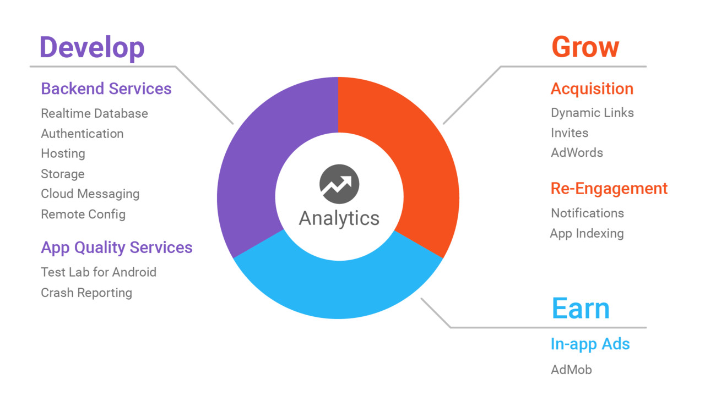

# Introdução

Grande parte dos projetos atuais, sejam web ou mobile, possuem uma certa complexidade em relação as ferramentas utilizadas. Um mesmo projeto pode conter um banco de dados, um serviço de armazenamento de arquivos, requisições para uma api (tanto proprietaria ou de terceiros), e mais. Tendo isso em mente, diferentes empresas buscam implementar soluções que integram todos esse serviços em um único lugar, para conveniência do desenvolvedor, evitando então, a dor de cabeça de integrar diferentes serviços de diferentes empresas. Alguns exemplos desses serviços seriam a AWS da Amazon, Google Cloud Services do Google e outros.
Neste documento serão vistos alguns serviços do firebase, que é uma ferramenta do Google, construída em cima dos serviços do Google Cloud e que facilita a integração de diferentes serviços em um projeto web ou mobile, de forma que, no final não pareça que os comandos executados na ferramenta de linha de comando vão explodir uma bomba ou que no fim do mês a fatura do cartão terá uma cobrança a mais de $100 (1 minuto de silêncio para nosso velho amigo Heroku).

## O que é ?

Firebase é uma ferramenta do Google que funciona como uma camada de abstração para os serviços do Google Cloud. Por meio de um painel de controle e com a ferramenta de linha de comando, o firebase, permite integrar e gerenciar os serviços do Google Cloud em sistemas web e mobile sem a necessidade de configurar um servidor. Os serviços do firebase são divididos em duas categorias: desenvolvimento e crescimento & ganhos.

Seviços de desenvolvimento são aqueles utilizados na etapa de criação e na etapa de qualidade de uma aplicação, como banco de dados, autenticação e autorização de usuários, armazenamento de arquivos, aplicação de testes, monitoramento de quedas, distribuição de versões betas de aplicativos moveis para clientes alvos e mais.  
Já os serviços de crescimento & ganhos são aqueles utilizados para impulsionar e monetizar a aplicação como, analytics, notificação em aplicativos moveis e outros.

## Benefícios

Firebase possui uma arquitetura `serveless`, isto é, que não necessita de configuração de servidor. Os recursos são disponibilizados em uma maquina em nuvem e escalam de acordo com o uso.   
O painel é amigavel e atráves do mesmo é possível monitorar o uso, visualizar os dados no banco, visualizar usuários registrados, visualizar as implatações realizadas, realizar rollback de versões e mais.  
Apesar dos serviços terem um custo, não existe a necessidade da vinculação um cartão de crédito e o plano gratuito (spark) possui uma alta quota de uso para alguns dos serviços disponiveis, tornando possível a construção de aplicações de médio porte sem nenhum ou com pouco gastos.